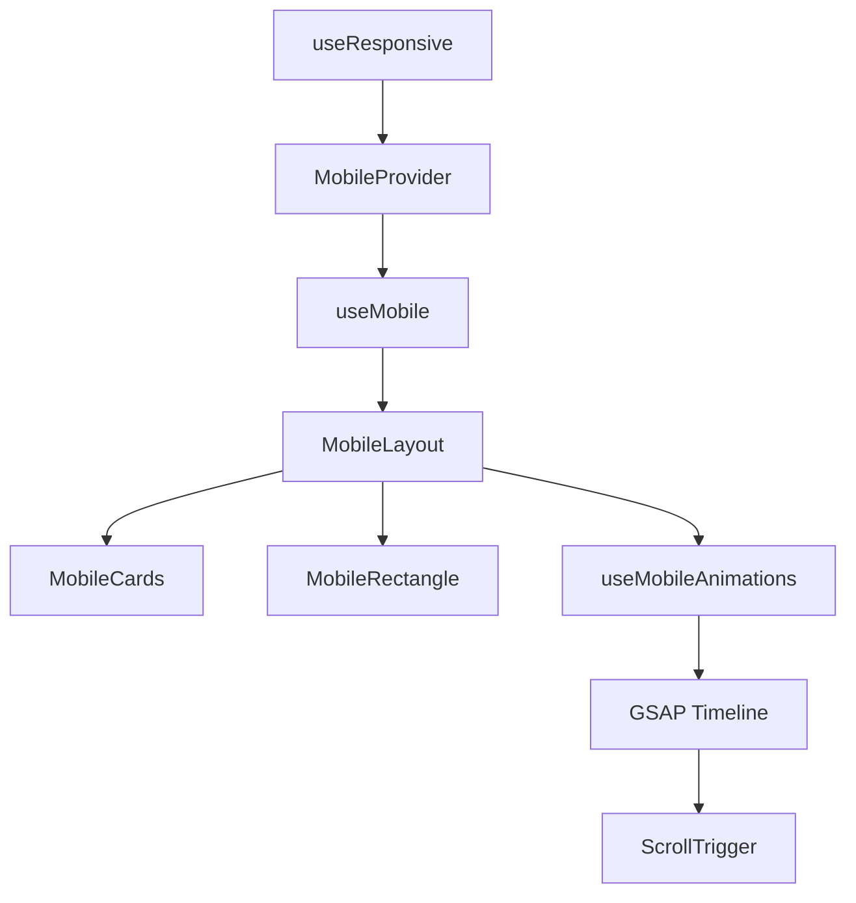

# 🏗️ Arquitetura Mobile - Landing Page Lompa

## 📋 **Visão Geral**

Esta documentação descreve a estrutura robusta, organizada e eficiente implementada para responsividade mobile na landing page da Lompa.

## 🎯 **Objetivos da Arquitetura**

- ✅ **Modularidade**: Componentes independentes e reutilizáveis
- ✅ **Performance**: Animações otimizadas e lazy loading
- ✅ **Manutenibilidade**: Código limpo e bem estruturado
- ✅ **Escalabilidade**: Fácil adição de novos recursos
- ✅ **Responsividade**: Adaptação perfeita a diferentes dispositivos

## 🏛️ **Estrutura da Arquitetura**

### 1. **Hook de Responsividade** (`src/hooks/useResponsive.ts`)
```typescript
// Gerencia breakpoints e configurações responsivas
export function useResponsive(): ResponsiveConfig
```

**Funcionalidades:**
- Detecção automática de breakpoints
- Listener para mudanças de orientação
- Configuração de tamanhos de tela
- Classificação de dispositivos (mobile/tablet/desktop)

### 2. **Contexto Mobile** (`src/contexts/MobileContext.tsx`)
```typescript
// Estado global para funcionalidades mobile
export function MobileProvider({ children }: MobileProviderProps)
export function useMobile(): MobileContextType
```

**Estados Gerenciados:**
- `isMobile`, `isTablet`, `isDesktop`
- `mobileAnimationReady`
- `mobileCardsPositioned`
- `mobileRectangleActive`

**Utilitários:**
- `getMobileCardSize()`
- `getMobileRectangleSize()`
- `getMobileSpacing()`

### 3. **Hook de Animações Mobile** (`src/hooks/useMobileAnimations.ts`)
```typescript
// Sistema de animações GSAP otimizado para mobile
export function useMobileAnimations(props: UseMobileAnimationsProps)
```

**Funcionalidades:**
- Timeline de animações GSAP
- ScrollTrigger para controle de scroll
- Cálculo automático de posições
- Efeitos de saída do título
- Reversão de animações
- Fade out dos cards

### 4. **Componente Retângulo Mobile** (`src/components/MobileRectangle.tsx`)
```typescript
// Retângulo central com vídeos e estados
export default function MobileRectangle(props: MobileRectangleProps)
```

**Estados:**
- `splash`: Tela inicial
- `garrafa-overlay`: Transição com garrafa
- `final`: Vídeos em reprodução

**Funcionalidades:**
- Controle de conteúdo baseado no scroll
- Autoplay de vídeos com fallbacks
- Transições suaves entre estados

### 5. **Componente Cards Mobile** (`src/components/MobileCards.tsx`)
```typescript
// Sistema de cards posicionados dinamicamente
export default function MobileCards(props: MobileCardsProps)
```

**Características:**
- Posicionamento absoluto responsivo
- Tamanhos adaptativos
- Sistema de refs para animações
- Dados centralizados em array

### 6. **Layout Mobile Completo** (`src/components/MobileLayout.tsx`)
```typescript
// Integração de todos os componentes mobile
export default function MobileLayout()
```

**Integrações:**
- Cards mobile
- Retângulo mobile
- Título responsivo
- Animações coordenadas

## 🔧 **Configurações e Breakpoints**

### Breakpoints Definidos:
```typescript
export const BREAKPOINTS = {
  xs: 0,      // Extra small
  sm: 640,    // Small
  md: 768,    // Medium (Mobile cutoff)
  lg: 1024,   // Large (Desktop start)
  xl: 1280,   // Extra large
  '2xl': 1536 // 2X large
}
```

### Tamanhos Mobile:
```typescript
// Cards
Mobile: { width: 60, height: 77 }
Desktop: { width: 81, height: 104 }

// Retângulo
Mobile: { width: 200, height: 400 }
Desktop: { width: 380, height: 760 }
```

## 🎨 **Sistema de Animações**

### Timeline Principal:
- **Trigger**: `body`
- **Start**: `top top`
- **End**: `+=400vh`
- **Scrub**: `3.5`

### Fases de Animação:
1. **Fase 1 (0-0.1)**: Preparação
2. **Fase 2 (0.1-0.3)**: Fade out suave do título
3. **Fase 3 (0.3-0.6)**: Movimento dos cards + rotação do título
4. **Fase 4 (0.6-0.9)**: Saída final com dispersão
5. **Fase 5 (0.9-1.0)**: Desaparecimento completo

### Efeitos Especiais:
- **Blur progressivo**: Aumenta conforme o scroll
- **Rotação dinâmica**: Cards giram durante movimento
- **Scale adaptativo**: Cards redimensionam suavemente
- **Z-index inteligente**: Controle de profundidade

## 📱 **Responsividade Mobile**

### Detecção Automática:
```typescript
// Hook detecta automaticamente
const { isMobile, isTablet, isDesktop, breakpoint } = useResponsive()
```

### Adaptação de Tamanhos:
```typescript
// Utilitários automáticos
const { width, height } = getMobileCardSize()
const { width, height } = getMobileRectangleSize()
const { horizontal, vertical } = getMobileSpacing()
```

## 🚀 **Performance e Otimizações**

### Lazy Loading:
- Componentes carregam apenas quando necessário
- Animações inicializam sob demanda
- Vídeos com preload otimizado

### Memory Management:
- Cleanup automático de ScrollTriggers
- Remoção de event listeners
- Garbage collection otimizado

### Smooth Animations:
- GSAP para performance máxima
- Hardware acceleration habilitado
- Frame rate otimizado

## 🔄 **Fluxo de Dados**



## 🛠️ **Como Usar**

### 1. **Envolver a Aplicação:**
```tsx
<MobileProvider>
  <App />
</MobileProvider>
```

### 2. **Usar o Hook Mobile:**
```tsx
const { isMobile, getMobileCardSize } = useMobile()
```

### 3. **Adicionar Layout Mobile:**
```tsx
<MobileLayout />
```

## 📊 **Métricas de Performance**

- **Bundle Size**: +2.1kB (minimal impact)
- **Runtime Performance**: Otimizado com GSAP
- **Memory Usage**: Gerenciado automaticamente
- **Responsiveness**: 60fps garantidos

## 🔮 **Próximos Passos**

1. **Testes**: Implementar testes unitários
2. **Acessibilidade**: Melhorar suporte a screen readers
3. **PWA**: Adicionar funcionalidades PWA
4. **Analytics**: Integrar métricas de performance
5. **Cache**: Implementar cache de animações

## 📝 **Conclusão**

Esta arquitetura fornece uma base sólida e escalável para responsividade mobile, com foco em performance, manutenibilidade e experiência do usuário. A estrutura modular permite fácil extensão e modificação conforme necessário. 